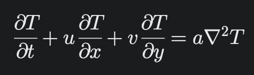
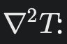
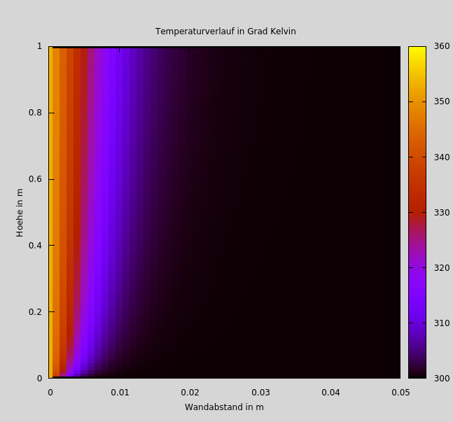
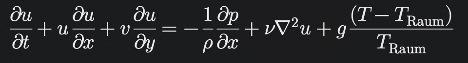
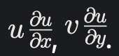
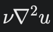
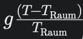
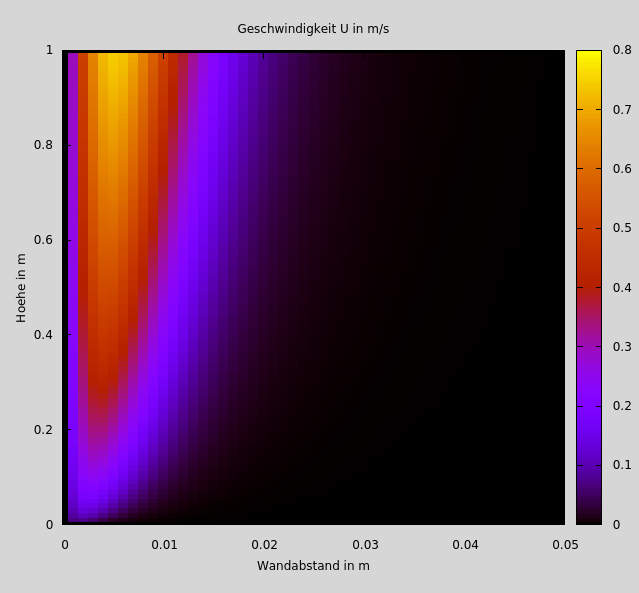
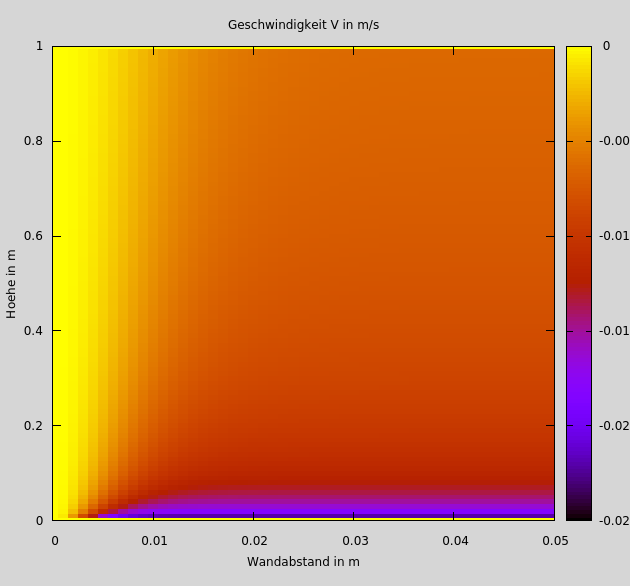

# **Strömungssimulation an einer heißen Metallplatte**

## **Projektbeschreibung**
Dieser Code verwendet diskretisierte Formen der:
- **Wärmeleitungsgleichung (Heat Transfer Equation):** Für die Berechnung der Temperatur T[j][i].
- **Navier-Stokes-Gleichungen:** Für die Berechnung der Geschwindigkeitskomponenten U[j][i] und V[j][i].

Zusätzliche Effekte:
- **Advektion:** Transport von Temperatur und Impuls durch die Strömung.
- **Diffusion:** Viskosität und Wärmeleitung.
- **Auftrieb:** Temperaturunterschiede und Gravitation.

Die Diskretisierung erfolgt nach dem **Finite-Differenzen-Verfahren (FDM)**, und die Iterationen werden solange ausgeführt, bis das Residuum einen definierten Schwellenwert unterschreitet.


## Verwendete Gleichungen
### 1. Temperaturentwicklung
```cpp
T[j][i]= (U[j][i]*T[j-1][i] -V[j][i]*T[j][i+1]
        + a*(T[j][i-1]+T[j][i+1])/Dl) / (U[j][i]-V[j][i]+ 2*a/Dl);
```
Dies ist eine diskretisierte Form der **Wärmeleitungsgleichung** mit Konvektion und Diffusion:


<br>

- **Parameter:**
  - U[j][i], V[j][i]\: Geschwindigkeitskomponenten in x- und y-Richtung.
  - a: Temperaturleitfähigkeit (thermische Diffusivität).
  - : Laplace-Operator für Wärmeleitung (diskretisiert).
  - T[j-1][i], T[j][i+1], T[j][i-1]: Temperaturen in benachbarten Zellen.


<br>
<div style="text-align: center;">
    
</div>
<br>

---


### 2. Geschwindigkeitsberechnung x-Komponente der Geschwindigkeit
```cpp
U[j][i]= (U[j][i]*(U[j-1][i]/Dl) - V[j][i]*(U[j][i+1]/Dl)
          + (nu*(U[j][i-1] + U[j][i+1])/(Dl*Dl)) + g*((T[j][i]-t_raum)/t_raum))
          /((U[j][i]/Dl)-(V[j][i]/Dl)+ (2*nu/(Dl*Dl)));
```
Dies ist eine diskretisierte Form der **Navier-Stokes-Gleichung für die x-Richtung**:


<br>

- **Terme:**
  - **Advektion:** 
  - **Diffusion:**  viskose Kräfte, diskretisiert mit U[j][i-1] + U[j][i+1]/(Dl*Dl).
  - **Buoyancy-Terme:** , beschreibt den Auftrieb durch Temperaturunterschiede.
  - nu: Kinematische Viskosität.
  - g: Gravitationsbeschleunigung.

<br>
<div style="text-align: center;">
    
</div>
<br>

---

### 3. Geschwindigkeitsberechnung für  die y-Komponente der Geschwindigkeit
```cpp
V[j][i+1] = V[j][i] + U[j-1][i] - U[j][i];
```
Das ist eine vereinfachte iterative Formel für die y-Komponente der Geschwindigkeit, basierend auf der Balance zwischen U- und V-Flüssen.

<br>
<div style="text-align: center;">
    
</div>
<br>

---

### 4. Residuenberechnung
```cpp
ResU[j][i] = fabs(fabs(U[j][i]) - fabs(tempU));
```
Hier wird das Residuum (die Änderung des Geschwindigkeitsfeldes zwischen Iterationen) berechnet, um die Konvergenz der Simulation zu überwachen.


## **Projektstrucktur**
```
├── plots/
│   ├── Plotwerte/
│   │   ├── Residuumsplotwerte.dat
│   │   ├── UPlotwerte.dat
│   │   └── VPlotwerte.dat
│   ├── readme_images/
├── src/
│   ├── Ergebnisse.txt
│   ├── Funktionen.h
│   ├── main.cpp
│   ├── Startwerte.txt
│   └── Variablen.h
├── .gitignore
├── README.md
```

---
